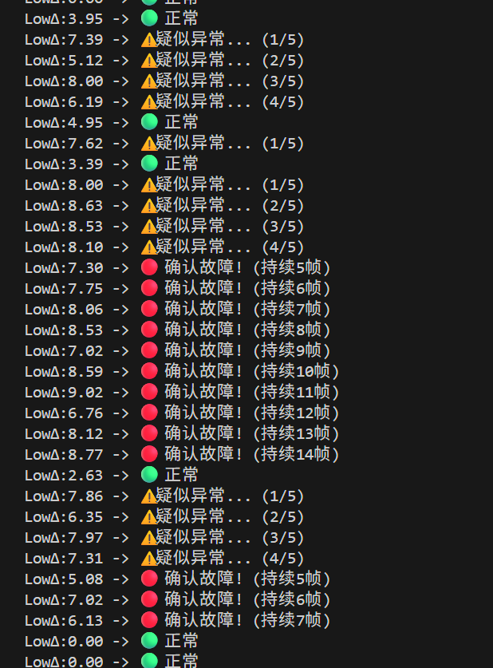
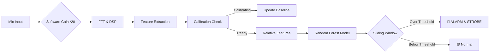

#  AI-Powered Anomaly Detector on ESP32
#  基于 ESP32 的边缘 AI 声音与震动异常检测器

> A predictive maintenance device running entirely on the edge. It uses Machine Learning (Random Forest) and DSP to detect mechanical anomalies (like fan failure or abnormal vibrations) in real-time.
>
> 一款完全在边缘端运行的预测性维护设备。它结合了机器学习（随机森林）与数字信号处理（DSP），能够实时检测机械故障（如风扇停转或异常震动）。

---

## Demo Video / 演示视频

<div align="center">
  <video width="100%" controls>
    <source src="Demo-Error-Old.mp4" type="video/mp4">
  </video>
  <em>Test Demo on bread board</em>
  <em>在面包板上的运行演示</em>
  <video width="100%" controls>
    <source src="Welded-Version-Demo-Error.mp4" type="video/mp4">
  </video>
  <br>
  <em>Test Demo on welded board</em>
  <em>焊接后在万用板上的运行演示</em>
  <em>Real-time detection: Strobe Blue Light = Anomaly Detected.</em>
  <br>
  <em>实时检测演示：闪烁蓝灯报警=检测到异常。</em>
</div>

---

## Key Features / 核心功能

1.  **TinyML on Edge / 边缘机器学习**:
    * Uses a `Random Forest` model trained in Python and deployed via `emlearn`.
    * 使用 Python 训练的随机森林模型，通过 `emlearn` 部署在单片机上。

2.  **Self-Calibration / 开机自适应校准**:
    * Automatically learns the ambient noise floor (Low/High frequency energy) during the first few seconds of boot.
    * 开机后一段时间自动学习环境底噪（低频/高频能量），适应不同工作环境。

3.  **Software Gain Amplifier / 软件信号增益**:
    * Built-in digital gain to compensate for hardware resistance losses on perfboards.
    * 内置数字增益，完美补偿万用板焊接带来的信号衰减。

4.  **Sliding Window Filter / 滑动窗口滤波**:
    * Rejects false positives using a 6-frame history buffer. Only triggers alarm when anomaly density is high.
    * 使用 6 帧历史缓冲区过滤误报，只有当异常密度达到阈值时才触发报警。

---

## Hardware Setup / 硬件清单

| Component (元件) | Description (描述) | Quantity (数量) |
| :--- | :--- | :--- |
| **MCU** | ESP32 DevKit V1 (Doit) | 1 |
| **Microphone** | INMP441 (I2S Omnidirectional) | 1 (or Array) |
| **Indication** | Onboard Blue LED (GPIO 2) | 1 |
| **Wiring** | Perfboard & Wires | - |

### 🔌 Pinout / 接线图

> **Note:** Do NOT connect WS/SCK to EN or VP pins!
> **注意:** 严禁将 WS/SCK 连接到 EN 或 VP 引脚！

| INMP441 Pin | ESP32 Pin | Function |
| :--- | :--- | :--- |
| VDD | 3.3V | Power |
| GND | GND | Ground |
| **SD** | GPIO 14 (or 32/33) | Serial Data |
| **SCK** | GPIO 26 (or 14) | Serial Clock |
| **WS** | GPIO 27 (or 13) | Word Select |
| L/R | GND | Set to Left Channel |




---

## Software Architecture / 软件架构

### 1. The Pipeline (处理流程)


### 2. Feature Engineering (特征工程)

The system does not use raw audio. It extracts 3 key features:
系统不直接使用原始音频，而是提取 3 个关键特征：

* **LowΔ (Low Frequency Delta):** Energy difference in 0-600Hz range vs. baseline. (Amplified by 3.0x).
* **HighΔ (High Frequency Delta):** Energy difference in 2kHz+ range vs. baseline.
* **DomHz (Dominant Frequency):** The loudest frequency component.

---

## Demo Video / 演示视频

<div align="center">
  <video src="./Demo-Error-Old.mp4" width="100%" controls></video>
  <video src="./Welded-Version-Demo-Error.mp4" width="100%" controls></video>
  <br>
  <em>Real-time detection: Strobe Blue Light = Anomaly Detected.</em>
  <br>
  <em>实时检测演示：闪烁蓝灯报警=检测到异常。</em>
</div>

---

## Installation & Usage / 安装与使用

1. **Hardware:** Solder the components on a perfboard or use a breadboard.
* *硬件：在万用板上焊接或使用面包板搭建电路。*


2. **Environment:** Install VS Code + PlatformIO.
* *环境：安装 VS Code 和 PlatformIO 插件。*


3. **Libraries:** Add `emlearn` to your `platformio.ini`.
* *库文件：在配置文件中添加 `emlearn`。*


4. **Flash:** Connect ESP32 via USB and click "Upload".
* *烧录：连接 USB 并点击上传。*


5. **Run:**
* **Phase 1:** Blue LED flashes twice. Keep quiet for 6 seconds (Calibration).
* **Phase 2:** System active. Simulate a fault (blow air or play low freq sound).
* **Phase 3:** LED strobes rapidly if anomaly is confirmed.


---

## Tuning / 参数调优

Modify `main.cpp` to fit your specific sensor sensitivity:
修改 `main.cpp` 以适应你的传感器灵敏度：

```cpp
// 1. Line Loss Compensation (线路损耗补偿)
// Increase if your mic signal is too weak
audio_buffer[buffer_index] = data.left_top * 20.0; 

// 2. Feature Sensitivity (特征灵敏度)
// Amplify low frequency features to make AI more sensitive
feat_low = feat_low * 3.0; 

// 3. Debounce Settings (防抖设置)
#define WINDOW_SIZE 6       // History length (历史长度)
#define ALARM_THRESHOLD 2   // Alarm trigger count (报警触发数)

```

```
